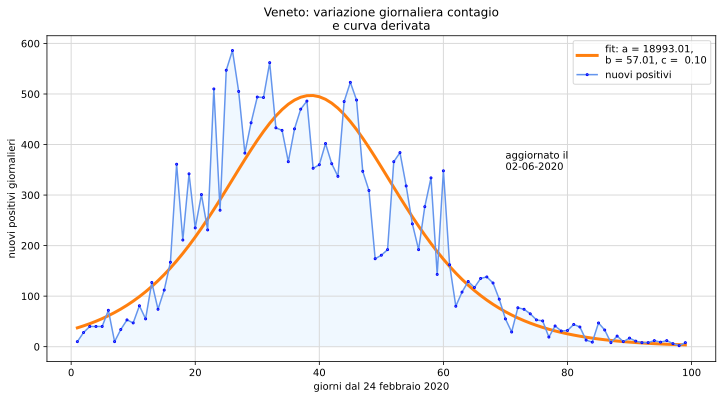

# Semplici modelli matematici di diffusione dei virus

Materiali didattici accessori alle pagine pubblicate nel sito [Bocconi MATEpristem](http://matematica.unibocconi.it) all'indirizzo [Semplici modelli matematici di diffusione dei virus](http://matematica.unibocconi.it/articoli/semplici-modelli-matematici-di-diffusione-dei-virus)

## Files

Nella cartella **didatticaCovid19** i notebook di [Jupyter](https://jupyter.org/) hanno estensione **jpynb** mentre i file dei dati  regionali si riconoscono per l'estensione **json** e quelli nazionali per l'estensione **csv**. Per quanto riguarda i file di dati se ne riportano solo alcuni utili alla sperimentazione mentre per disporre dei più recenti ci si riferisca al sito della Protezione Civile sul [Covid-19](https://github.com/pcm-dpc/COVID-19).

## Consultazione

Per una consultazione *non interattiva* dei notebook e dei dati selezionare l'icona di *nbviewer* per disporre dell'elenco dei file ed avviare la visualizzazione.

Nel caso si intenda sperimentare online in modo interattivo con i notebook di [Jupyter](https://jupyter.org/) lanciare *Binder* e, dopo alcuni secondi necessari al caricamento dell'immagine sul server, selezionare uno dei quattro notebook *ipynb*.

*Lorenzo Roi*